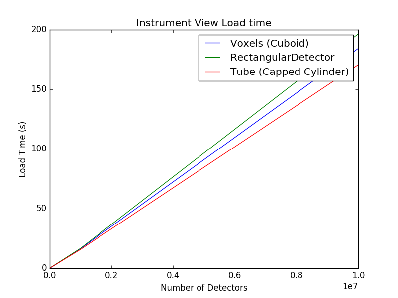
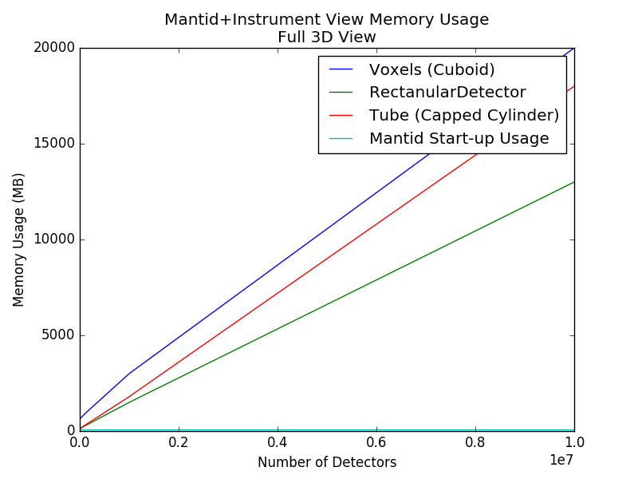
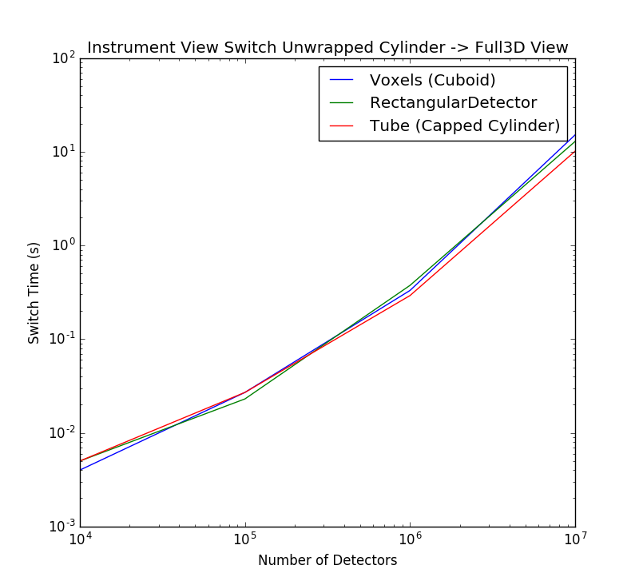

## Instrument View Performance with Voxels

### Hardware
Test was performed using a PC with the following specs:
- i7 2.60Ghz
- 32GB Ram

### Qualitative Performance 

Mantid and the instrument view seems happy with voxels up to ~200K. The instrument view interface becomes sluggish > 300K and is virtually unusable above ~600k. Switching between instrument representations e.g unwrapped to Full 3D stalls for at least 15  seconds above 10^6^ detectors. Pick functionality is still very responsive, however changing instrument orientation etc is extremely slow. 

### CSPEC Geometry
CSPEC Geometry is implemented using the naive approach of defining Cuboids for each voxel. There isn't currently another type which would facilitate faster loading.

### Instrument View Loading

The first graph below shows the time taken to load the instrument view as a function of the number of detectors for different instrument types. The second graph shows the memory used by Mantid with the instrument view loaded into the Full 3D view. The `LoadEmptyInstrument` algorithm was used to load the IDFs so there was no data attached to the instrument.

### Switching Instrument Representation

The graph below shows how long it takes to switch from the Cylindrical Unwrapped view in the Instrument View to the Full 3D view. It is important to note that switching to the Side-by-Side view takes much longer. With the full CSPEC Geometry, I terminated mantid after waiting 6 minutes for the Side-by-Side representation to load. Again, this test was associated with empty workspaces.

### Performance Profiling

The Visual Studio 2015 CPU Sampling tool was used to profile the Instrument View for the scenarios described in the previous sections. When loading the entire CSPEC instrument in the Instrument View, it seems ~50% of the effort is spent on Qt related operations and the majority (~40%) of the remaining effort is spent in `MantidQt::MantidWidgets::UnwrappedSurface::CalcSize` (the default load for the instrument is Unwrapped Cylinder as defined in the IDF).

When switching from the Unwrapped Cylinder to the Full 3D view, 34% of CPU effort is spent in `MantidQt::MantidWidgets::ObjCompAssemblyActor::generateTexture`, 28% is spent in `MantidQt::MantidWidgets::ObjCompAssemblyActor::setDataColors` and 26% is spent in `Mantid::Geometry::CacheGeometryRenderer::Render`.

When switching from Unwrapped Cylinder to Side-By-Side, Most CPU resources (99.29%) were spent on `MantidQt::MantidWidgets::PanelsSurface::addFlatBank` 44% of this time was spent on `MantidQt::MantidWidgets::UnwrappedDetector::operator=`.

