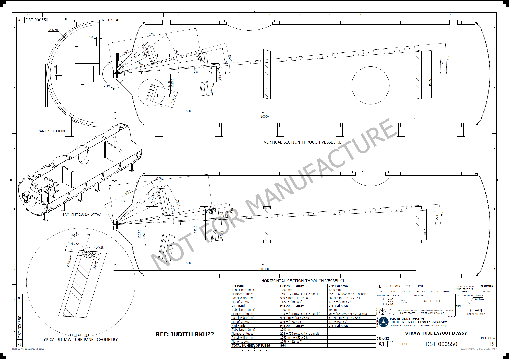
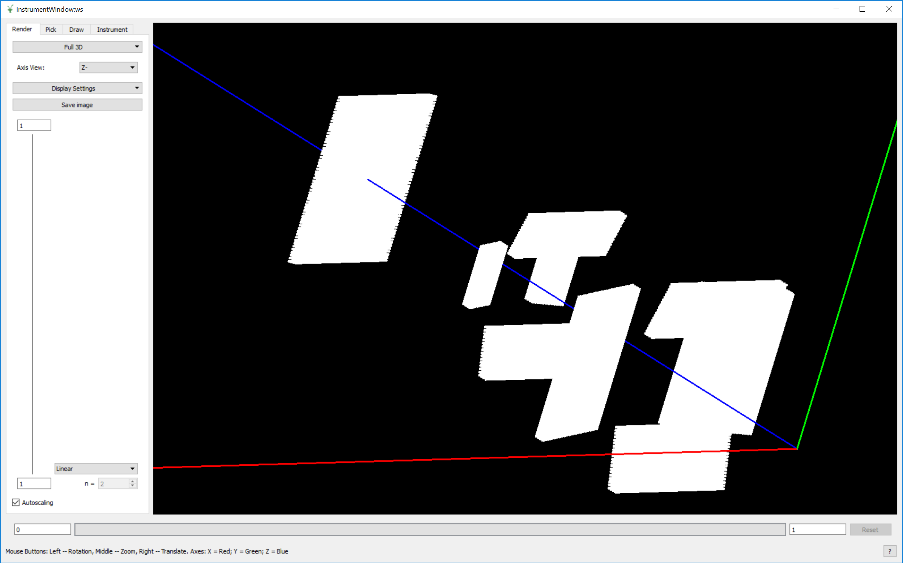

# LOKI Live Reduction Performance in Mantid

## Motivation

The LOKI instrument for small angle neutron scattering is scheduled to be one of the first instruments to come online for the ESS. As such, it is important that the day 1 requirements for the software are satisfied before the instrument enters the commissioning phase. LOKI will be ~1Mpixels with an incident flux between 105Hz and 108Hz (worst case). This represents a significant processing and storage challenge for the ESS. Since Mantid has been chosen as the data-reduction platform at the ESS, it is critical that the software can cope with these data rates. This document outlines the current performance of the Mantid framework and recommendations for improvements which may allow performance to meet the requirements.

## Scope
This document only covers performance benchmarks for the LOKI instrument based on the geometry described in the proceeding section. A general benchmarking exercise of the live data reduction in Mantid was performed [here](https://github.com/DMSC-Instrument-Data/documents/blob/master/investigations/Live%20Reduction/LiveReductionInvestigation.md) and this document may be referenced within.

## LOKI Geometry
The LOKI Geometry used for these tests are as specified in the engineering diagrams below. The instrument consists of 864 tubes (6048 straws) with an intrinsic resolution of 5mm. Straw lengths vary between 1.2m and 0.5m which gives a total pixel count of 1,245,880pixels.

## Hardware 

The hardware used for these tests is as follows:

- 128GB RAM
- Intel(R) Core(TM) i9-9920X CPU @ 3.50GHz

## Live Consumption Tests
### Event rates
This document only explores performance at a target rate of 107events/s as a worst case since day 1 instrument flux of 1MW, ramping up to 2MW, will not result in an incident flux beyond this for LOKI. See [ess-hardware-requirements-report-v1.pdf](report.pdf) produced by Simon Heybrock.

### Measurement Interpretation
The ESS pulse rate for neutrons is expected to be **14Hz**. This will be the rate at which messaged will be produced in the Kafka system and therefore consumed by Mantid. Measurements are taken in this context. If Mantid is capable of processing events (writing events to in-memory data structures and performing basic reduction) at this rate at a target neutron flux, this indicates that Mantid can cope with the event rate.
### Previous Efforts
The performance of Mantid for live data streaming/reduction was evaluated and results presented in the following document [LiveReductionInvestigation](https://github.com/DMSC-Instrument-Data/documents/blob/master/investigations/Live%20Reduction/LiveReductionInvestigation.md). Following from this work Lamar Moore (ISIS), Dan Nixon (ISIS/ESS-in-kind) and Simon Heybrock (ESS) met December 2018 in Copenhagen to discuss and prototype strategies for addressing performance bottlenecks in this area. The result of this work can be found [here](https://github.com/DMSC-Instrument-Data/documents/blob/master/meeting_notes/December_2018/agenda.md). After this meeting the team reached the following conclusions:

- Optimizing Mantid to satisfy ESS performance requirements is achievable with current time and resource.
- The optimization effort can be carried out without the need for MPI (distribution of the event stream for use on a HPC Cluster).
- The optimizations are straightforward. 

**There were previous small optimizations made as part of the live reduction investigation which resulted in a small performance improvement. Tests conducted in this investigation are from that basis.**
### Random Data Test (Writing to Workspace)
#### Data
The data was generated using the following tools ESS-based tools:

- [python-nexus-utilities](https://github.com/ess-dmsc/python-nexus-utilities)
- [generate-nexus-files](https://github.com/ess-dmsc/generate-nexus-files)
- [NeXus-Streamer](https://github.com/ess-dmsc/NeXus-Streamer)

An Mantid XML instrument definition file (IDF) was produced based on the geometry described above ([LOKI IDF](LOKI_Tube_Definition.xml)). The IDF was fed into `generate-nexus-files` to produce the corresponding Nexus geometry file. This file was streamed to a kafka broker which existed in a containerised (Docker) instance on the local computer so that network effects could be ignored. The nexus streamer was used in random mode so that large numbers of fake, random data could be produced for all banks at a pre-determined rate.
#### LOKI Performance with Random Data
The initial test for LOKI at 107Hz yielded a maximum kafka message consumption rate in Mantid of ~6Hz. This initial test was performed without the optimizations mentioned in the *Previous Efforts* section of this document. They were also performed on a machine with the following specifications:

- 64GB RAM
- 7th Gen Intel Core i7 Quad Core (8 threads) 8MB SmartCache

Subsequently, further optimizations to the Mantid live reduction code was performed by Dan Nixon. The detail of which is outlined below:

*Instead of received events (from the Kafka stream) being immediately inserted into an EventWorkspace they are instead stored in a buffer held by the decoder.
When this buffer is full (where full is a number of events set by the user) it is sorted to place events from the same detector in the same period adjacent to one another. This locality is then used to allow those events to be inserted into the EventWorkspace in parallel (as division of the work across threads can guarantee no EventList is accessed on multiple threads).*

*Instead of storing a hash map of detector to workspace index (which is slow to index), a vector is created where the indices represent detector numbers and the values are the associated workspace index (which is much faster to index but would typically use more memory).*

These optimisations pushed the achievable kafka message consumption rate to >20Hz which satisfies, and exceeds, the 14Hz target.

#### Conclusion
Even with random data (noise), which represents the worst case scenario for event collection, Mantid is able to cope with an event rate of 107Hz. **N.B** This is only for writing events to the Workspace and performing a simple rebin to histogram for the output workspace.

### MCStas/Geant4 Simulated Data Test (Writing To Workspace)
### MCStas/Geant4 Simulated Data Test (With Live Reduction Script)

 