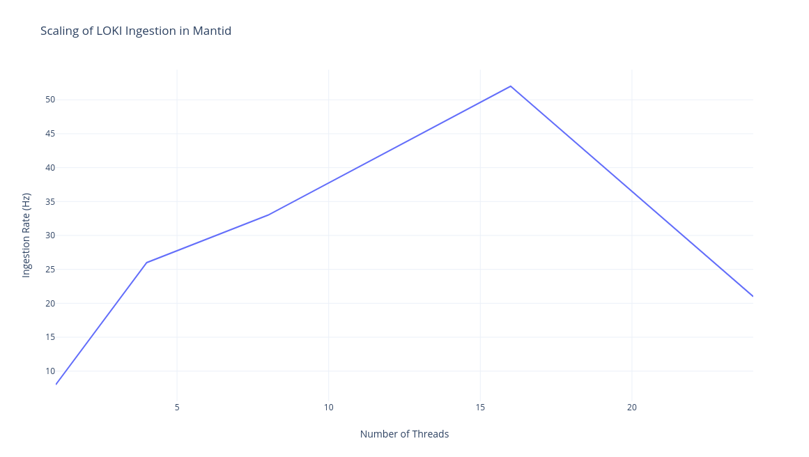

# LOKI Live Reduction Performance in Mantid
## Table of Contents
- [Overview](#overview)
	- [Motivation](#motivation)
	-  [Summary](#summary)
	-  [Scope](#scope)
	-  [LOKI Geometry](#geometry)
	-  [Build-out Phases](#phases)
	-  [Hardware](#hardware)
- [Outcomes](#outcomes)
	- [Interpretation of Measurements](#measurements)
	- [Mantid Data Ingest](#ingest)
		- [Scaling](#scaling)
	- [SANS Data Reduction Workflow](#workflow)
	- [SANS Live Reduction](#reduction)
		- [Run Duration](#runduration)
- [Live Consumption Tests](#tests)
	- [Previous Efforts](#previous)
	- [Random Data Test](#random)
		- [Data Generation](#generation)
		- [LOKI Performance with Random Data](#randomperf)
		- [Result](#result)
	- [McStas/Geant4 Simulated Data Test](#datatest)
		- [Writing to a Mantid Workspace](#workspace)
		- [With Live Reduction Script](#script)
- [Conclusion](#conclusion)
	- [Further Recommendations](#recommendations)


# Overview <a name="overview"></a>
***

### Motivation <a name="motivation"></a>

The [LOKI instrument](https://europeanspallationsource.se/instruments/loki) for small angle neutron scattering is scheduled to be one of the first instruments to come online for the ESS. As such, one of the [High Level DMSC Milestones](https://confluence.esss.lu.se/pages/viewpage.action?pageId=262411283) is to ensure the data reduction software can cope with the proposed instrument flux in a live data reduction scenario. LOKI will be ~1Mpixels with an incident flux between 10<sup>5</sup>events/s and 10<sup>8</sup>events/s (worst case). This represents a significant processing and storage challenge for the ESS. Since Mantid has been chosen as the data-reduction platform at the ESS, it is critical that the software can cope with the expected data rates in preparation for hot comissioning and early science in mid 2023. The maximum instrument flux during these phases is set to be ~10<sup>7</sup>events/s. This document outlines the current performance of the Mantid framework and recommendations for improvements which may allow performance to meet the requirements.

### Summary <a name="summary"></a>

The Transition to Operations Milestone for the DMSC requires exactly:

```
1. Data can be reduced on the fly for expected flux of <INSTR> when in full operation. Data are received from DAQ & Streaming system.
2. Data can be post rereduced on cluster
3. Need to be able to define the scaling parameter for the acrhtecture rather than actually physically demonstrate
```

LOKI at 10<sup>7</sup>events/s at 14Hz is the target rate and `LOKI` is the DMSC agreed substitution for `<INSTR>`

1. The target rate for both ingest and full data reduction using the best available analogue to the LOKI data reduction workflow (ISIS SANS). The target rates were met for both on the hardware described below. See details in following sections.
1. The data was not post rereduced on a cluster in these experiments. However a single workstation proved able to deal with the Data in "Live Mode". Live and post collection Data Reduction is the subject of forthcoming experiments at V20 September 2019, and we intend to demonstrate those capabilities, though a cluster will not be required. 
1. The measurements for ingest show we achieve linear scaling will number of threads. The Mantid specific profiling shown below shows some good thread utilisation, with other algoritmic areas which should be subject of attention as part of planned future work.


### Scope <a name="scope"></a>
This document only covers performance benchmarks for the LOKI instrument based on the geometry described in the proceeding section. A general benchmarking exercise of the live data reduction in Mantid was performed [here](https://github.com/DMSC-Instrument-Data/documents/blob/master/investigations/Live%20Reduction/LiveReductionInvestigation.md) and this document may be referenced within. 
Additionaly, this document only explores performance at a target rate of 10<sup>7</sup>events/s which corresponds to the predicted initial operational flux to 2MW. See [ess-hardware-requirements-report-v1.pdf](report.pdf) produced by Simon Heybrock for details.

### LOKI Geometry <a name="geometry"></a>
The LOKI Geometry used for these tests are as specified in the engineering diagrams below. This design supersedes the initial BandGEM approach and will be utilizing a straw tube implementation. This decision to use straw tubes was fixed in early 2018. The instrument consists of 864 tubes (6048 straws) with an intrinsic resolution of 5mm. Straw lengths vary between 1.2m and 0.5m which gives a total pixel count of 1,245,880pixels.


### Build-out Phases <a name="phases"></a>

Currently "Day 1" operations for LOKI are set to commence November 2022. The initial instrument will contain the rear detector bank and 2 panels (one horizontal and one vertical) in the front and middle banks each. The resulting instrument will consist of ~473K pixels. However based on initial simulations, most of the detected neutron beam will be concentrated on the rear bank. The remaining banks are currently set to be added to the final instrument between 1-5 years beyond 2022. Hot commissioning and early science for this instrument are set for mid 2023 with full operations at the start of 2025.

### Hardware <a name="hardware"></a>

The hardware used for these tests is as follows:

- 128GB RAM
- Intel(R) Core(TM) i9-9920X CPU @ 3.50GHz
- Target Linux Platform (OpenMP is a hard requirement)

# Outcomes <a name="outcomes"></a>
***
### Interpretation of Measurements <a name="measurements"></a>
The ESS pulse rate for neutrons is expected to be **14Hz**. This will be the rate at which messaged will be produced in the Kafka system and therefore consumed by Mantid. Measurements are taken in this context. If Mantid is capable of processing events (writing events to in-memory data structures and performing basic reduction) at this rate at a target neutron flux, this indicates that Mantid can cope with the event rate.

### Mantid Data Ingest <a name="ingest"></a>

Data consumption into Mantid using realistic SANS data generated using GEANT4 resulted in an average consumption rate of ~24Hz. This was performed at an event flux of ~1.4e<sup>7</sup> events per message. This clearly shows that Mantid can comfortably deal with the ingest of data at these high rates.

##### Scaling
There was previous work done in investigating how well the live streamer in Mantid scales and was presented in this document [LiveReductionInvestigation](https://github.com/DMSC-Instrument-Data/documents/blob/master/investigations/Live%20Reduction/LiveReductionInvestigation.md). Scaling for LOKI ingesting the simulated data showed the following trend:

`#` of threads|Message Consumption Rate (Hz)
---|---
1|8
4|26
8|33
16|52
24<sup>*</sup>|21



<sup>*</sup> <sub>Note that at 24 threads it is assumed the host system is oversubscribed due to running Mantid, Kafka broker and NeXus publisher simultaneously as well as hyperthreading.</sub>

### SANS Data Reduction Workflow<a name="workflow"></a>
The Data reduction used for these performance investigations was the ISIS SANS Reduction workflow which was decided in 2018 as part of the DMSC milestones (see [here](https://confluence.esss.lu.se/pages/viewpage.action?pageId=262411283)). Profiling on this workflow was performed by Neil Vaytet (ESS)> The data for this test was produced using Geant4 and converted into a Mantid data structure for processing. The results are shown below:


In this test, 12 CPU cores were allocated to the data reduction, we see the reduction is mostly using all allocated cores most of the time. This suggests this workflow is currently optimised to make use of parallel CPU architectures. However, `ConvertUnits` seems to be entirely single threaded and half of the `Rebin` operation is single-threaded. Recommendations for optimizing the workflow are presented in the last section of this document. A [Jira ticket](https://jira.esss.lu.se/browse/DR-246) has been created to address these recommendations.

### SANS Live Reduction <a name="reduction"></a>

The ingest of data into Mantid was coupled with the ISIS SANS Workflow to assess the impact on the message consumption rate. Mantid reported an average consumption rate of ~18Hz. This is still above the 14Hz target but there is the possibility of optimizing the SANS workflow algorithms to obtain better performance.

#### Run Duration <a name="runduration"></a>

The predicted duration for a single LOKI run at 10<sup>7</sup>Hz is 10 seconds assuming 10<sup>8</sup> events are required for the data reduction (see the [ess-hardware-requirements-report-v1.pdf](report.pdf)). This will result in ~5GB of event data which should not present any major storage issues in memory or on disk provided the number of runs can stay within the hardware limitations of the provided computing framework.

# Live Consumption Tests <a name="tests"></a>
***
### Previous Efforts <a name="previous"></a>
The performance of Mantid for live data streaming/reduction was evaluated and results presented in the following document [LiveReductionInvestigation](https://github.com/DMSC-Instrument-Data/documents/blob/master/investigations/Live%20Reduction/LiveReductionInvestigation.md). Following from this work Lamar Moore (ISIS), Dan Nixon (ISIS/ESS-in-kind) and Simon Heybrock (ESS) met December 2018 in Copenhagen to discuss and prototype strategies for addressing performance bottlenecks in this area. The result of this work can be found [here](https://github.com/DMSC-Instrument-Data/documents/blob/master/meeting_notes/December_2018/agenda.md). After this meeting the team reached the following conclusions:

- Optimizing Mantid to satisfy ESS performance requirements is achievable with current time and resource.
- The optimization effort can be carried out without the need for MPI (distribution of the event stream for use on a HPC Cluster).
- The optimizations can be implemented within 2-3 person months.

**There were previous small optimizations made as part of the live reduction investigation which resulted in small performance improvements in the live streamer. Tests conducted in this investigation started with these small optimizations as opposed to the state of the current Mantid release.**
### Random Data Test (Writing to Workspace) <a name="random"></a>
#### Data Generation <a name="generation"></a>
The data was generated using the following tools ESS-based tools:

- [python-nexus-utilities](https://github.com/ess-dmsc/python-nexus-utilities)
- [generate-nexus-files](https://github.com/ess-dmsc/generate-nexus-files)
- [NeXus-Streamer](https://github.com/ess-dmsc/NeXus-Streamer)

An Mantid XML instrument definition file (IDF) was produced based on the geometry described above ([LOKI IDF](LOKI_Tube_Definition.xml)). The IDF was fed into `generate-nexus-files` to produce the corresponding Nexus geometry file. This file was streamed to a kafka broker which existed in a containerised (Docker) instance on the local computer so that network effects could be ignored. The nexus streamer was used in random mode so that large numbers of fake, random data could be produced for all banks at a pre-determined rate.
#### LOKI Performance with Random Data <a name="randomperf"></a>
The initial test for LOKI at 10<sup>7</sup>Hz yielded a maximum kafka message consumption rate in Mantid of ~6Hz. This initial test was performed without the optimizations mentioned in the *Previous Efforts* section of this document. They were also performed on a machine with the following specifications:

- 64GB RAM
- 7th Gen Intel Core i7 Quad Core (8 threads) 8MB SmartCache

Subsequently, further optimizations to the Mantid live reduction code was performed by Dan Nixon. The detail of which is outlined below:

*Instead of received events (from the Kafka stream) being immediately inserted into an EventWorkspace they are instead stored in a buffer held by the decoder.
When this buffer is full (where full is a number of events set by the user) it is sorted to place events from the same detector in the same period adjacent to one another. This locality is then used to allow those events to be inserted into the EventWorkspace in parallel (as division of the work across threads can guarantee no EventList is accessed on multiple threads).*

*Instead of storing a hash map of detector to workspace index (which is slow to index), a vector is created where the indices represent detector numbers and the values are the associated workspace index (which is much faster to index but would typically use more memory).*

These optimizations pushed the achievable kafka message consumption rate to >20Hz which satisfies, and exceeds, the 14Hz target.

#### Result <a name="result"></a>
Even with random data (noise), which represents the worst case scenario for event collection, Mantid is able to cope with an event rate of 10<sup>7</sup>Hz. **N.B** This is only for writing events to the Workspace and performing a simple rebin to histogram for the output workspace.

### MCStas/Geant4 Simulated Data Test <a name="datatest"></a>

Realistic LOKI data was generated by Judith Houston (ESS LoKI instrument scientist) using McStas and Geant4. This simulated data was ingested into Mantid to produce a Nexus file which could be used in the `NeXus-Streamer` for our test purposes. The dataset consists of neutrons scattered on the rear LOKI panel ignoring the front 2 banks (as pictured below).


The data file contained ~1M events which represented a single pulse. In order to generate a longer run, data was duplicated over 840 pulses (60 second run at 14Hz). This data was then streamed into Kafka and used to test consumption rates and data reduction rates. The data used for these tests can be here:

- [Geant4Data](https://github.com/DMSC-Instrument-Data/documents/tree/master/investigations/LOKI/test_data/lokiGeant4Data.out). 
- [Script to convert Geant4 Data to Nexus](https://github.com/DMSC-Instrument-Data/documents/tree/master/investigations/LOKI/test_data/Geant4ToNexus_Mantid.py) (Needs to be run from Mantid)

#### Writing To a Mantid Workspace <a name="workspace"></a>

Data consumption rates averaged ~24Hz (messages) at an event rate of ~1.4e<sup>7</sup>Hz. This utilized a 30s timeout for `MonitorLiveData` and a basic `Rebin` operation for displaying data on the instrument. The event buffer stored 2.5e<sup>7</sup> events before writing to the workspace.

#### With Live Reduction Script <a name="script"></a>

The test for live reduction was carried out using the following basic script (taken from previous tests):

**Test SANS Script**
```python
# SANS Reduction Realistic
ConvertUnits(InputWorkspace="accum_events", OutputWorkspace="ws", Target="Wavelength")
FindCenterOfMassPosition(InputWorkspace="ws", Output="CentreOfMass")
com = mtd["CentreOfMass"]
beam = com.column(1)
MoveInstrumentComponent(Workspace="ws", ComponentName="Panel_9_horz_1000_back", X=beam[0], Y=beam[1], RelativePosition=True)
MoveInstrumentComponent(Workspace="ws", ComponentName="Panel_1_horz_1200_top", X=beam[0], Y=beam[1], RelativePosition=True)
SANSSolidAngleCorrection(InputWorkspace="ws", OutputWorkspace="ws", DetectorTubes=False, DetectorWIng=False)
SANSAbsoluteScale(InputWorkspace="ws", OutputWorkspace="ws", ScalingFactor=0.99)
Rebin(InputWorkspace="ws", OutputWorkspace="ws", Params="74294664", PreserveEvents=False)
Q1D(DetBankWorkspace="ws", OutputWorkspace="SANSReduced", SolidAngleWeighting=False, OutputBinning="1,5,100")
```

Data consumption rates averaged ~18Hz (messages) at an event rate of ~1.4e<sup>7</sup>Hz. All other configurations were fixed as in the previous case.

# Conclusion <a name="conclusion"></a>
***
The final optimizations added to Mantid have facilitated live streaming which will meet expected requirements for coping with projected instrument flux. The scalability of the solution also demonstrates that as processor architectures improve and scale in future iterations, we will be in a good position to handle increasing flux. There are currently no recommended actions required for parallelisation/distribution of Mantid for live streaming. There are however recommendations for improving the SANS reduction workflow itself.

### Further Recommendations <a name="recommendation"></a>

**Optimizing the reduction workflow**

`ConvertUnits`:

There are several ways the `ConvertUnits` algorithm can be optimized, if its
runtime becomes a bottleneck for the reduction.

First, the profiling shows that threading is unused for the entire execution of
the algorithm. A closer look at the source code revealed that threading is
only enabled in the `convertQuickly` [function](https://github.com/mantidproject/mantid/blob/master/Framework/Algorithms/src/ConvertUnits.cpp#L331)
which is used for simple conversions where only a single factor or a power is
to be applied to the values.
In all other cases, where conversion is performed via the time-of-flight unit,
threading is not in use. We do not see any major stumbling blocks in the way
of threading being extended to the more complex conversions in the future.

Second, a virtual function call is made for every data element, and removing
this could also be a potential avenue for optimization. Some work on this was
started in 2017 by Simon Heybrock
(see [here](https://github.com/mantidproject/mantid/tree/ConvertUnits_performance)).


`Rebin`:

The first half of the execution of the `Rebin` algorithm uses only a single
thread. The source code for `Rebin` is relatively compact and finding the
locations of the non-threaded sections should be straightforward.


`FindCenterOfMassPosition`:

The first part of this algorithm uses threading, but everything after the call
to `CreateWorkspace` is not. Parallelising the [loop](https://github.com/mantidproject/mantid/blob/master/Framework/Algorithms/src/FindCenterOfMassPosition2.cpp#L157) on the number of spectra
should give a good performance boost.


`CreateWorkspace`:

A large part of the `CreateWorkspace` algorithm is non-threaded. It is not
immediately clear how easy it would be to remedy this.

 
