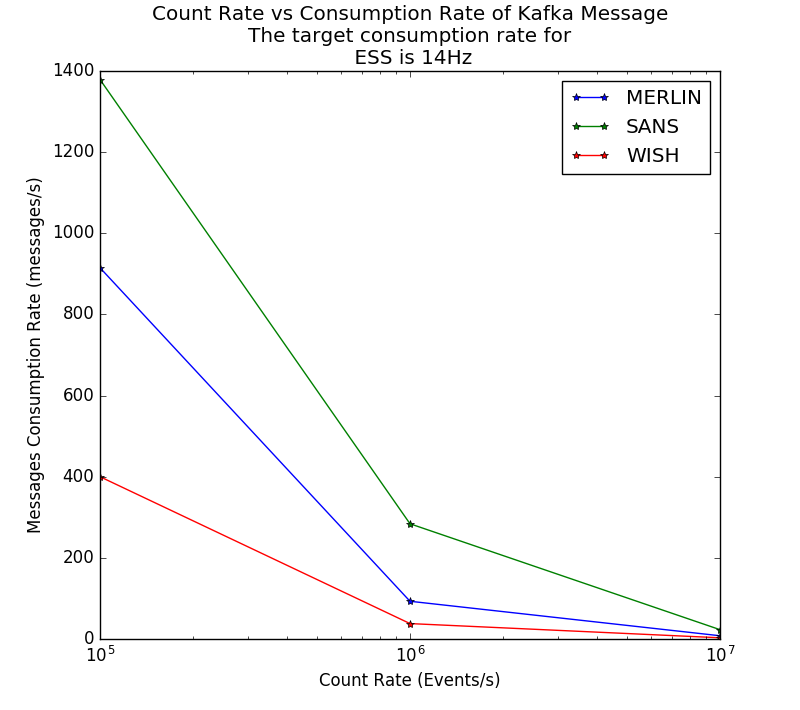
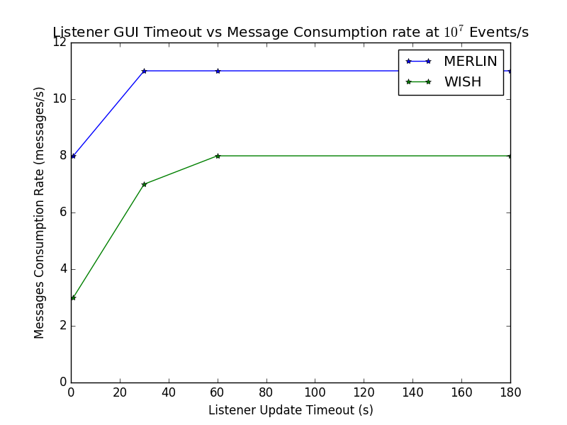

# Evaluation of the KafkaStreamer for ESS
## Motivation
The KafkaStreamer has been previously developed to support live streaming of event data from a kafka broker into Mantid. 
The purpose of this document is to present an evaluation of the this streamer in the context of the ESS. 
The ESS will make use of a Kafka architecture which produces messages at a rate fixed to the frequency of the neutron source, 14Hz (frames per second). 
Therefore, any live streaming mechanism in Mantid should be able to support the consumption of kafka messages at or above 14Hz for sensible event detection rates. 
ESS instruments are expected to produce detection rates in the 10<sup>7</sup>Hz range or ~714286 events per kafka message.

## Live Consumption Tests
The first stage of testing involved the scenario where the instrument data is inspected in the absence of any data reduction. 
A single workstation was used to run a docker image which contained the configuration for a Kafka broker. 
Data was published to the broker using the `main_nexusPublisher` which can be found [here](https://github.com/ess-dmsc/NeXus-Streamer). 
The `main_nexusPublisher` accepts event nexus files and publishes events to a kafka stream. 
This application also supports producing random events at user-defined rates, based on an input nexus file, which facilitated stress testing Mantid for our purposes. 
All instructions for the setup of the broker and using the `main_nexusPulisher` can be found in the link above.

Three instruments with varying numbers of detectors were chosen for this investigation. 
Due, to the limitations of the current implementation of the `main_nexusPublisher` we were restricted to using ISIS nexus files. 
The selected instruments were:

**Table 1: Selected instruments and their corresponding pixel count**

Instrument|Number of Detectors
---|---
SANS2D|122'888
MERLIN|286'729
WISH (10 panel)|778'245

### Results
**Table 2: Event rate versus message consumption rate for each instrument**

Event Rate|SANS2D|MERLIN|WISH
:-:|--:|--:|--:
10<sup>5</sup>Hz|1379Hz|915Hz|400Hz
10<sup>6</sup>Hz|284Hz|93Hz|38Hz
10<sup>7</sup>Hz|23Hz|8Hz|3Hz



The figure above shows the trend in event rate versus message consumption rate. 
The `MonitorLiveData` timeout was set to one second. 
SANS2D was able to maintain a 23Hz consumption rate at 10<sup>7</sup> event rate with a 1 second refresh rate of the live listener. 
Enabling the instrument view for inspection did not seem to affect the message consumption rate for any of the instruments. 
Both MERLIN and WISH were unable to support rates of 10<sup>7</sup> with consumption rates of 7Hz and 3hz respectively. 
At 10<sup>6</sup>, MERLIN consumed Kafka messages at a rate of 93Hz and WISH at 38Hz.

**Table 3: Effect of `MonitorLiveData` refresh rate on message consumption rate where the event rate is fixed at 10<sup>7</sup>Hz**

Timeout (seconds)|MERLIN|WISH
--:|--:|--:
1|8Hz|3Hz 
30|11Hz|7Hz
60|11Hz|8Hz
180|11Hz|8Hz



The above figure shows that increasing the `MonitorLiveData` timeout can result in a slight improvement in performance. 
This is however very limited and efforts to improve the listener design for performance should not depend too heavily on this.

## Effects of Live Processing

### Rebin
#### Effects of Bin Size
Running the `Rebin` algorithm on a chunk-by-chunk basis seems to have no deleterious effects on rates when running in event mode. 
When adding events and rebinning to histograms discarding events (e.g the code snippet below for clarity):

```python
StartLiveData(Instrument='Sans2D', OutputWorkspace='SANS_Live',
              FromNow=False, FromStartOfRun=True, Listener='KafkaLiveLister',
              Address='localhost:9092', UpdateEvery=3,
              ProcessingAlgorithm='Rebin',
              ProcessingProperties='PreserveEvents=0;Params=1,1000,100006',
              AccumulationMethod='Add', PreserveEvents=False,
              RunTransitionBehaviour='Stop')
```

increasing the number of bins hugely impacts performance. 
For SANS2D at ~10<sup>6</sup>Hz, performance dropped from **120Hz** (messages/s) at 100 bins, to **100Hz** at 1000 bins and finally **38Hz** at 10000 bins. 
With `AccumulationMethod=Replace` the performance decreases to **40Hz**.   

#### Effects of Timeout
Increasing the `MonitorLiveData` timeout naturally increases the memory overhead, however it does not seem to have any noticeable effect on performance.

#### Effects of Available Cores

Rebin itself scales linearly with the number of available cores (until after hyperthreading where gains are minimal).
There does not seem to be any interference with the decoder thread even when the number of cores is set to the maximum number available on the machine which suggests there may be some room to improve performance in the decoder itself.
A simple modification of sorting the events by detectorID in the decoder before adding to event lists boosted speeds from **120Hz** to **155Hz**

#### Note on Using Instrument View in Histogram Mode
Whilst in histogram mode as described in the above section, heavy use of the instrument view (picking, instrument manipulation etc), resulted in performance dropping from **120Hz** to **100Hz** with 100 bins.

#### Test Optimization

The table below shows the effects of introducing multi-threading to the eventlist population. 
The event data is first sorted by `spectrum index` and ranges which contain duplicate spectrum numbers are grouped, these ranges are then used in conjunction with OMP threads to populate the event lists asynchronously.

**Table 4: Effects of Introducing Multi-threading to decoder EventList population.**
Number of OMP Threads|SANS2D (3s timeout)|WISH (60s timeout)
--:|--:|--:
1 (No TBB Sort)|119Hz|9Hz 
1|170Hz|11Hz
2|211Hz|13Hz
4|264Hz|15Hz
8|269Hz|14Hz
12|278Hz|15Hz
20|293Hz|15Hz