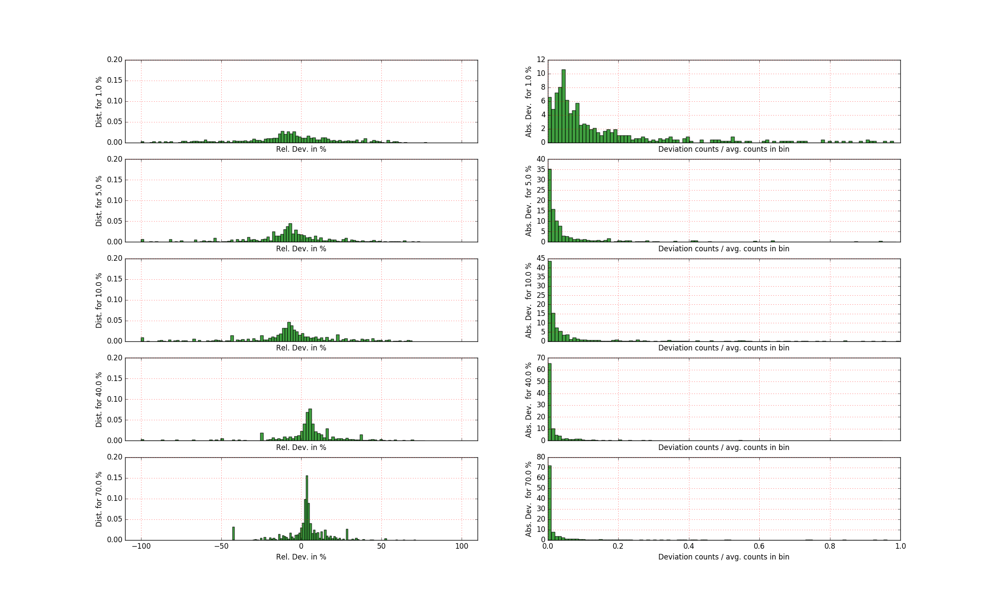

# N percent approach

In the n-percent approach a small fraction of the data is used in order to
estimate what the overall momentum space distribution of the data will be. To be
more precise, the first n percent of the measurement are used, i.e. the data is
filtered by the pulse time. In principle there is no reason to assume that the
distribution of the events is vastly differnt when looking at a fraction of the
data, since neither the sample nor the beam move during the measurement.
However, there is of course an influence of the noise level (otherwise the measurement could stop at n percent). Since the assumption that the n-percent approach works for the data sets we are looking at, we need to ensure that this approach is valid.

### N percent approach on TOPAZ data set

We use the `TOPAZ_3132_event.nxs` data set which can be found in the system
test directory. The idea is to compare the full data set to the n-percent data set.
The steps are:

1. Produce a n-percent data set from the original data set.
2. Apply *BinMD* to both data sets. The binning is kept at 20 in each dimension.
3. Calcualte the relative and absolute difference between the n-percent and the original data set, i.e.
   `relative_difference = (original - n_percent \* n) / original` and
   `absolute_difference = (original - n_percent \* n)`

   Note that values for which both the original and the n_percent bins are zero are not recorded.
4. Separate the outliers from the main data. The relative deviation and the
   absolute deviation both have large outliers. However looking one without
   considering the other leads to wrong conclusions. For example, if we
   are dealing with small counts then the relative difference can be very large,  however compared to the average count per bin it might be negligible. Similarly, if we have a very large absolute difference, then it might stem from very large signal values, e.g. where a peak falls into a bin. In this case the relative deviation might be small. Note however that this can still be an issue.

   In order to filter out false outliers, we only consider data points as outliers if they:
   * have a relative deviation of more than 100%.
   * an original value which is larger than 10% of the average count per bins.
   * have an absolute deviation of more than the average count per bins.

The script to evaluate this can be found [here](n_percent_approach.py).

The result of this evaluation can be seen below:

The plot shows the evaulation for 1%, 5%, 10%, 40% and 70%. Columns are:
1. **Relative deviation:** It can be seen that the difference is fairly broad
spread between -50% and 50% for the 1% case and its mode is close to 10%. The
spread of values decreases and the mode shifts to 0 as the fraction of the n_percent data set increases.
3. **Absolute deviation:** The absolute deviation is normalized to the average number of events per bin. For the 1% case most of the data fluctuates less than 0.3, which drastically reduces when going to 5%. In general it shows that the absolute value of the vast majority of deviations is quite small.

Note that with the above definition of outliers, we did not record any outliers. However there are data points which are not shown here which have large absolute deviations (but small relative deviations) and vice versa. It should noted however that there have been absolute differences which were 140 times the average counts per bin at a 1% data set. This kind of behaviour was observed up until 40% data sets. This might be a problem.
