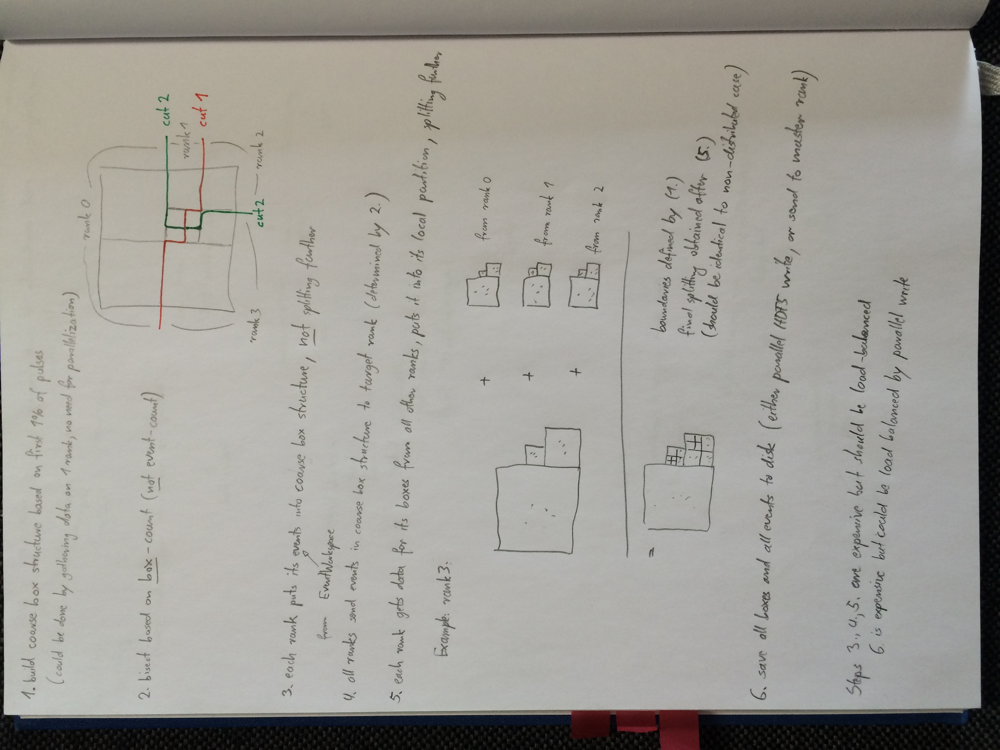

## Simon's load balancing approach

Simon proposed a load balancing approach which resembles the Recursive
Coordinate Bisection (RCB) approach, but without imprinting the cluster
topology onto the data structure. A schematic of the approach is shown below:

### Creation steps

1. **`n%` sampleing on single rank:**
   The first n% of the data is sent to the master rank, which builds a
   Mantid adaptive mesh. Note that the amount of data should be sufficient
   to allow a good estimation of the data distribution, but not too much such
   that we can fit it onto a single rank.

2. **Data structure split:**
   Once the data is split, we decide which regions are handled by which rank.
   A first thought was to use a RCB-style approach. However, it seems that
   a Space Filling Curve (SFC) approach might be more appropriate here. The number
   of ranks we want to distribute the data to is p. It makes most sense to
   split by the number of events M. This means we want to distribute M/p events
   to each node.

   In order to find the parts of the tree which belong to a particular node, we
   perform a depth first traversal. This resembles an SFC traversal. While we
   traverse, we create a cumulative sum of the events. If this sum reaches a
   value of M/p we assign all *MDBox* es up to this box to rank 0. We reset the
   counter and continue to travese until the sum reaches M/p again. This
   *MDBox* range is assinged to rank 1. This process continues until all
   *MDBox* s are assigned to a particular rank.

   A question is to how define the range of *MDBox* elements. The `MDBox::m_fileID`
   would be the first candidate to use, however since this is created in a
   breadth-first manner, it is not compatible with the SFC approach. Hence the
   best option seems to use the position of the *MDBox* in the depth first
   traversal.

3. **Sharing tree structure:**
   At this point we have a standard adaptive mesh tree and know which leaf nodes
   of the tree should be processed by each rank. This information is sent from
   the master rank to all other ranks.

   Next we transfer the tree structure (without the events) to each rank. While
   sending the tree structure too all ranks is a broadcast operation, the
   serialization of the tree for the broadcast is in parts a solved problem.
   We have dealt with a similar situation when writing to file. The `MDBoxFlatTree`
   allows for serialization of the box structure into several vectors. These
   can be standardly transmitted. The deserialization can also make use of
   the `MDBoxFlatTree` implementations.

   Now that we have an empty skeleton on each rank, we add events to it. One
   caveat is that boxes which get filled beyond the threshold must not split.
   Obtaining this behaviour should only require some trivual enhancement to the `BoxController`.

4. **Distributing data**:
   On each rank we have placed the data into the skeleton. Now we want to
   send the data which does not belong here to the correct rank.

   We iterate through the box structure if the box is at a position which is
   not associated with the local rank, then we know we have to send the data
   to another rank. Since we know the position of the box in the depth-traversal, we also know its receiving rank from step 2. We
   send the data to that rank and continue.

   This will have k*p*p communications in which most of the data will be transfered, where k is the number of leaf boxes. However data is transferred only once during the entire tree construction. This makes it better than a standard RCB where data will be sent potentially several times.

   The communication should be possible with `send-receive` pairs between all ranks (Can this handle empty vectors too?). Each rank will expect to
   receive a message from each rank for each box. The boxes can be indexed
   via a mpi tag (or other mean).

   Events of boxes which do not belong to the current rank and have been sent can be deleted on the local rank. It is probably best to replace this box
   with a new box type like a `NullBox` which will throw if standard box methods are called on it. It could be a `static` endpoint to save memory.

5. **Merging the data**:
   Once the data has been received, the data needs to be placed into the corrected local boxes. It makes sense to not add these event vectors via
   standard insertion into the tree but to do this directly on the local *MDBox* es vectors.

6. **Split boxes**
   Reset the `BoxController` back to normal operation. Iterate through all boxes and start off the splitting.

   Issues:
    * Q: How to provide the fileID which is being generated by the  `BoxController`? Is this really needed?
      A: It is required since it actually defines the starting point of the
         children in the tree.

    The box labelling issue can be resolved with a local fileID count for each
    rank. The local `BoxController` reserves continguous integer values for
    the new boxes starting from the last fileID which had been provided to the
    global part of the tree, i.e. the last box of the tree which has been
    shared among all the ranks. Once the splitting has completed, we want to
    calculat the global prefix sum of the number of new boxes on each rank. This will allow for offsetting the local fileID values. For example, if rank 0 has produced 10 new boxes, then the fileIDs on rank 1 need to be
    offset by 10. If rank 1 has produced 20 new boxes, then the fileIDs for
    the new boxes on rank 2 need to be offset by 30.  

### Saving the distributed data structure

The current implementation of saving the *MDEventWorkspace* s has been described [here](../algorithm_categorization/load_and_save.md).

The first step is to create an `MDBoxFlatTree` object which will create a
flattened version of the box structure. This essentially creates several
arrays which contain information about box types their relations, their attributes and the position and number of their events (provided it is an *MDBox*).

The file is populated in a breadth-first traversal of the tree (since the
fileID increases in this manner). The first part of the tree is common to all
nodes and could be written out by rank 0.

The other ranks should be able to write the data in parallel since the file locations, where the data will be stored are known and they are contiguous. According to [this]() writting data to a contiguous hyperslab can be done by
several ranks in parallel. This means that the box inforamtion itself should be parallel-writable.

The last part of the problem is saving out the events. They are, sensibly, placed into a completely separate slab. The information which is stored with the box structure is the position of the events and the number of events for that box. The position of the events of the first *MDBox* b1 will be pos(b1)=0  and has N0 events. The position of the events of the second *MDBox* will be pos(b2)=pos(b0) + N0 and so on. Hence in order to determine the event position we will require the prefix sum of the events for the ranks. This works in a similar manner as with the fileID for the boxes. Once this has been calculated and distributed, then the events can also be stored in a parallel write operation.
