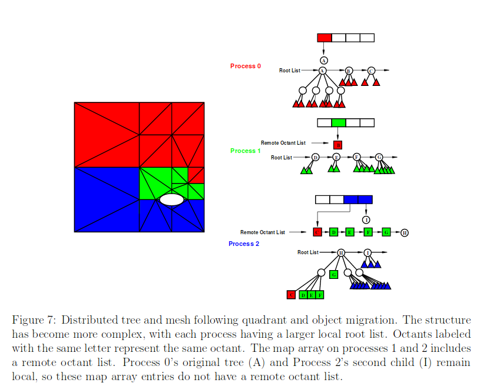

# Space filling curve load balancing algorithms

The Zoltan library provides some niche algorithms which might be of interest to
us. The two approaches are Hilbert Space Filling Curve for (HSFC).
and Refinement Tree Partitioning

We only look at the HFSC method here. This algorithm is normally applied to
 quadtrees/octrees. A good description of the algorithm can be
found [here](https://pdfs.semanticscholar.org/949f/0d4ea6d730f29aa11d42c061f3ddbd68888d.pdf)
Note that this algorithm will be able to produce a load-balanced distributed
data structure, but it does not seem to be immune to load spikes when
redistributing the data. The example which is illustrated below is taken
from the referenced paper above.

### Algorithm

Here we will only have a look at the parallel case, where we have p nodes and
a total of N data points. The steps are:
1. `Initial space partition`:
   Every rank creates a global octree. The root level defines the entire
   domain. The octree splits up to a certain level. The level is determined by
   the number of participating ranks p. The level is Log(p)(note that the base
   is 8 for the octree), since we want one segment per rank. Each global octant
   has a unique rank as the owner. Only the terminal nodes of this global octree
   are required and stored in a map array. Each rank has global octants assigned
   to them.  The knowledge which rank is responsible for which octant is known
   between all ranks.
   

   In the the example above we have three ranks p=3 and divide. The region of
   interest is split 1:2:2 between the three ranks. The global quadrants are
   stored in an array, where each quadrant has a unique rank as the owner. After
   the ownership has been established, the tree it self is not important
   any longer, since all the required information is in the map array.

2. `Initial distribution and refinemnet`:
   Every octant can hold M data points, before it needs to be refined (split).
   On each node we build up the local octree. Each node will have, in
   the homogeneous case N/p data points of which some are already in the right
   quadrant and other data points which are orphaned and belong in quadrants
   which are managed by other processes. For randomly distributed data we would
   expect the fraction of the data which is already on the correct node to be
   N/p. These data points need to be migrated to the correct processor and
   locally the octree construction is completed. **Note: At this point the
   algorithm does not guarantee that the data which is pushed to a node is
   less than the memory limit that the node can handle**.
   We ignore this issue for now, since we might be able to circumvent this issue
   by creating the initial split via a sample set of the total data.
   
   In our example, each rank has a local root list which contains the the local
   roots of the sub-trees on the rank. They are maintained in a depth-first
   traversal order. At this point the elements in the local rank are just the
   first levels of the global quadrants that are associated with the rank.

3. `Cost calculation`:
   Once the octree has been built, we need to calculate the prefix cost of the
   data. Note that this part is better explained [here](http://apps.fz-juelich.de/jsc-pubsystem/aigaion/attachments/SPartA_IPDPSW.pdf-299184f32c306328b4abeef3981a0075.pdf).
   The prefix cost is calculated on each rank separately, i.e. without interprocess
   communication. The nodes of the tree are traversed and each terminal
   node (leaf) is associated with a prefix cost, i.e. the accumulated cost
   up to the current traversal point. The cost of a leaf is normally some
   weigth, e.g. in our case this would be the number of events held in the leaf
   node. The prefix cost of that leaf node would be the sum of all events up to
   that node. Clearly, the prefix cost of a particular terminal node will depend on
   how the nodes are traversed. This is where space filling curves eventually
   come into play, but this can be separated out and we will look
   at this later.

   Besides calculating the local prefix costs we calculate the total cost per
   rank which is communicated to the other nodes. From this we can
   calculate the total cost TC of all nodes and the prefix costs PC of the
   ranks themselves. The ranks' prefix costs offset the prefix costs of
   the local leaves. This essentially establishes a global ordering of leaves,
   with minimal interprocess communication.

   An optimal load-balanced split is defined by OS=TC/p where p is the number
   of ranks and TC is the total cost, e.g. the total sum of events. This
   means we can load-balancing our data without loosing co-locality of leaves by
   traversing the the leaves with using the space filling curve and setting
   split points when the sufficient leaves have accumulated to be part of
   a single rank. The splitting positions are defined by r*OS with 1<r<p.
   The local prefix costs (including the global offset of the rank) can be used to
   determine if a leaf is residing on the correct node or not. If it is not on the
   correct node, then we know from the split points and from its prefix to which
   node it should be mapped.

   

   In the example, we see that the terminal nodes on the ranks are labelled
   with the destination rank.

4. `Redistribution`:
   This is the hard (and messy) part. Data which has been assigned to an other
   rank needs to be migrated to that rank. There are four steps to this:
   1. The leaf nodes that need to migrate to the same rank are gathered and
      the destination rank is notified.
   2. The destination rank allocates the required memory and communicates the
      new address back to the source rank. The source rank places (I assume)
      a forwarding leaf into the place of the migrating leaf.
   3. The leaves are sent to the destination rank and the deleted on the source
      rank.
   4. We need to update the booking-keeping. On the destination rank, the newly
      migrated leaves are added to the root list. On the source rank the
      a second list, the remote octant list is created. The addresses of the
      migrated leaves are added here (in depth-first traversal order).

   

A similar approach with a refinement-tree partitioning is presented
[here](http://math.nist.gov/~WMitchell/papers/reftree.pdf). From the limited
details in the paper, it appears that the splitting approach is very similar.

##### Traversal

For the traversal of the leaves, several strategies can be applied. The Morton order
is very commonly used but suffers from fairly large jumps. Hilbert ordering
is more compute-intensive, but doesn't show the same jumping behaviour. However
it is more compute intensive. They all suffer from the fact that they are very
suitable for 2D, less so for 3D and for higher dimensions are still a subject of
investigation. Nevertheless, there are some approaches which seem to make
it possible to have Hilbert curves in 3D+ scenarios.See
[here](https://arxiv.org/pdf/1601.01274.pdf). In the case described above,
it is easy to have floating point coordinates for the events, since everything is ordered in a
boxes which can be represented by integer-multiples of a minimal box.

Other ways of performing sorting via a space filling curve are presented
[here](https://surface.syr.edu/cgi/viewcontent.cgi?article=1033&context=eecs). Note
that this seems to be one of the most important papers in the field.  

Very recently (08/2017), a paper has been published which seems to provide
code to convert floating point values onto a Hilbert curve. See
[here](https://arxiv.org/pdf/1708.01365.pdf). Note that this paper is only on the
Arxiv and has not been published yet.

##### n% approach

The n% improvement strategy was suggested as an optimization. In the scenario
above the space filling curve is defined by the box structure and not the
position of the events. However, the events create the box structure. This means
that raw data points, i.e. the remaining (1-n)% of our data don't map with their
coordinates into the Hilbert curve. If this [paper](https://arxiv.org/pdf/1708.01365.pdf)
proves to be right, then there is a chance that this might work. However sorting
adding these events locally might turn out to be tricky.

### Final data structure

The above scheme will create a fully-fledged quadtree/octree. The creation
of refinement meshes is also possible with this approach.

In order to understand the costs of the operations better we should run through
some typical operations that we might perform on the distributed data structure.
We will briefly look at Q space conversion and *IntegratePeaksMD*. In addition
we want to have a look how we could visualize the data.

#### Creation

1. The raw event data is converted to Q space on each node. This is a runtime cost of O[N/p].
2. The data is split in a simple manner and naively redistributed on a per quadrant
   basis. If we assume random p ranks and p quadrants, and we assume homogeneous data
   distribution then each rank has O[N/p] data of which the fraction 1/p will
   be on the correct node. Hence we would have to transmit O[N/p(1-1/p)] data points per rank.
3. The tree structures are locally built and the leaves which should be transferred
   to other ranks are identified. Note that if we were dealing with homogeneous data,
   we would not expect to have any required transfers. At this point it is hard to
   estimate the total data transfer as it depends on the actual data set. An upper
   bound is of course O[N/p]. Once we have exchanged the data and provided the links
   we have a distributed tree structure, where some branches cross between ranks.

#### Using the distributed data structure for spherical peak integration.

Peak integration has one of its main algorithms operating in Q space, *IntegratePeaksMD*.
This algorithm is described [here](../algorithm_categorization/pure_event_algorithm_description.md)

The algorithm will take a peak position, radius and background radius as inputs
(which it gets from the *PeaksWorkspace*). The algorithm calls `integreateSphere`
on the top level box.  The `integreateSphere` method iterates over all child boxes
and checks if their vertices are fully or partially contained in the integration
region. If the box is fully contained in the integration region, then the box's
signal is added to the integrated signal; if the box contributes partially,
then the child box is recursively investigated.

In our case each rank would start the search on the octant that it has assigned
too it. Note that it would also search in each of the remote quadrants which
it has a handle to. This would compare in a similar way to the other approaches.

##### Visualizing data

We assume again that we have to map the distributed event-based data structure
to a file-backed workspace. The approach that we have current for Mantid would
work similarly with this data structure since both are trees. Note again that
the top level would have a different kind of splitting, than internal nodes,
hence we would require again a new kind of box type. The same considerations
as with RCB apply here.

RCB has an issue when naively reloading data, since the initial rank structure
is baked into the distributed data structure. This is not the case here. When
traversing the global tree we would not need to store the cross-rank links
themselves. This means that the serialized data structure would not have any
information about the involved ranks baked in, however this would also mean
that we could not easily reload the data into a cluster. How this could be
achieved is not clear at all at the moment.
