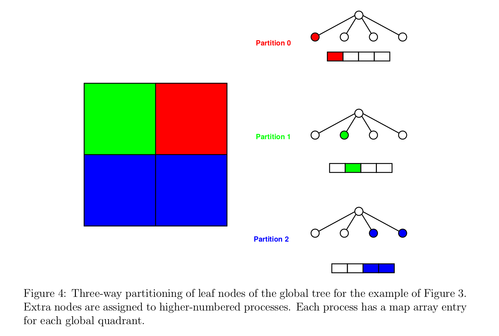
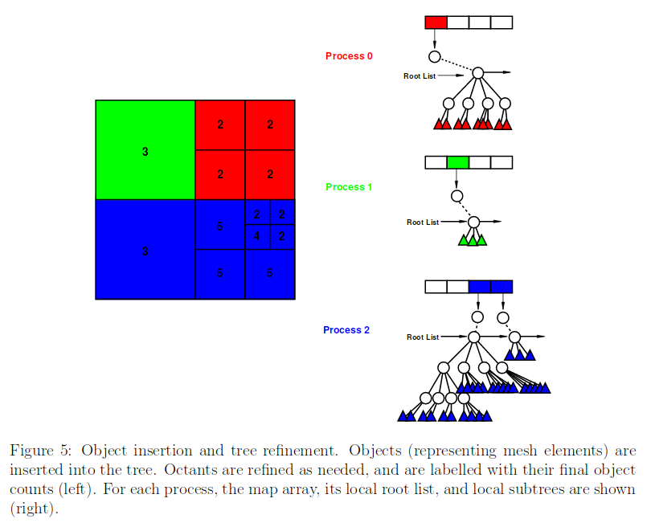
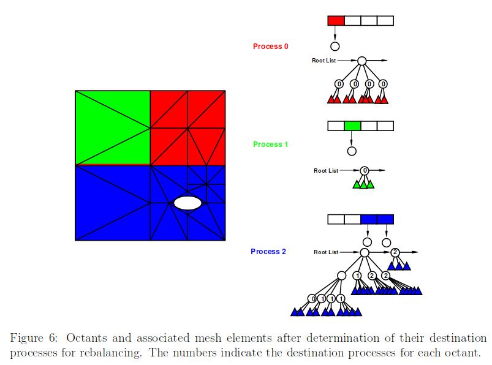

# Space filling curve load balancing algorithms

The Zoltan library provides some niche algorithms which might be of interest to
us. The two approaches are Hilbert Space Filling Curve for (HSFC).
and Refinement Tree Partitioning

We only look at the HFSC method here. This algorithm is normally applied to octrees. A good description of the algorithm can be found [here](https://pdfs.semanticscholar.org/949f/0d4ea6d730f29aa11d42c061f3ddbd68888d.pdf)
Note that this algorithm will be able to produce a load-balanced distributed
data structure, but it does not seem to be immune to load spikes when
redistributing the data. The example which is illustrated below is taken
from the referenced paper above.

Here we will only have a look at the parallel case, where we have p nodes and
a total of N data points. The steps are:
1. `Initial space partition`:
   Every rank creates a global octree. The root level defines the entire
   domain. The octree splits up to a certain level. The level is determined by
   the number of participating ranks p. The level is Log(p)(note that the base
   is 8 for the octree), since we want one segment per rank. Each global octant
   has a unique rank as the owner. Only the terminal nodes of this global octree
   are required and stored in a map array. Each rank has global octants assigned
   to them.  The knowledge which rank is responsible for which octant is known
   between all ranks.
   

   In the the example above we have three ranks p=3 and divide. The region of
   interest is split 1:2:2 between the three ranks. The global quadrants are
   stored in an array, where each quadrant has a unique rank as the owner. After
   the ownership has been established, the tree it self is not important
   any longer, since all the required information is in the map array.

2. `Initial distribution and refinemnet`:
   Every octant can hold M data points, before it needs to be refined (split).
   On each node we build up the local octree. Each node will have, in
   the homogeneous case N/p data points of which some are already in the right
   quadrant and other data points which are orphaned and belong in quadrants
   which are managed by other processes. For randomly distributed data we would
   expect the fraction of the data which is already on the correct node to be
   N/p. These data points need to be migrated to the correct processor and
   locally the octree construction is completed. **Note: At this point the
   algorithm does not guarantee that the data which is pushed to a node is
   less than the memory limit that the node can handle**.
   We ignore this issue for now, since we might be able to circumvent this issue
   by creating the initial split via a sample set of the total data.
   
   In our example, each rank has a local root list which contains the the local
   roots of the sub-trees on the rank. They are maintained in a depth-first
   traversal order. At this point the elements in the local rank are just the
   first levels of the global quadrants that are associated with the rank.

3. `Cost calculation`:
   Once the octree has been built, we need to calculate the prefix cost of the
   data. Note that this part is better explained [here](http://apps.fz-juelich.de/jsc-pubsystem/aigaion/attachments/SPartA_IPDPSW.pdf-299184f32c306328b4abeef3981a0075.pdf).
   The prefix cost is calculated on each rank separately, i.e. without interprocess
   communication. The nodes of the tree are traversed and each terminal
   node (leaf) is associated with a prefix cost, i.e. the accumulated cost
   up to the current traversal point. The cost of a leaf is normally some
   weigth, e.g. in our case this would be the number of events held in the leaf
   node. The prefix cost of that leaf node would be the sum of all events up to
   that node. Clearly, the prefix cost of a particular terminal node will depend on
   how the nodes are traversed. This is where space filling curves eventually
   come into play, but this can be separated out and we will look
   at this later.

   Besides calculating the local prefix costs we calculate the total cost per
   rank which is communicated to the other nodes. From this we can
   calculate the total cost TC of all nodes and the prefix costs PC of the
   ranks themselves. The ranks' prefix costs offset the prefix costs of
   the local leaves. This essentially establishes a global ordering of leaves,
   with minimal interprocess communication.

   An optimal load-balanced split is defined by OS=TC/p where p is the number
   of ranks and TC is the total cost, e.g. the total sum of events. This
   means we can load-balancing our data without loosing co-locality of leaves by
   traversing the the leaves with using the space filling curve and setting
   split points when the sufficient leaves have accumulated to be part of
   a single rank. The splitting positions are defined by r*OS with 1<r<p.
   The local prefix costs (including the global offset of the rank) can be used to
   determine if a leaf is residing on the correct node or not. If it is not on the
   correct node, then we know from the split points and from its prefix to which
   node it should be mapped.

   
   In the example, we see that the terminal nodes on the ranks are labelled
   with the destination rank.

4. `Redistribution`:
   This is the hard (and messy) part. 

Sending the data to the correct node. In general the receiving node needs
   to be made aware that data will be sent. Depending on the tree, this set up
   will also require inter-node references, which looks not completely straightforward.

For the traversal of the leaves, several strategies can be applied. The Morton order
is very commonly used but suffers from fairly large jumps. Hilbert ordering
is more compute-intensive, but doesn't show the same jumping behaviour. However
it is more compute intensive.

#### Dimensionality

The space filling curve approach is ideal for 2D cases and has been extended to
3D, e.g. in Zoltan. Higher-dimensional curves are still a subject of
studies. However, there are implementations for them. See [here](https://arxiv.org/pdf/1601.01274.pdf).  

#### n% approach

It is not very obvious that the n% sampling can be applied for this algorithm.
TODO
