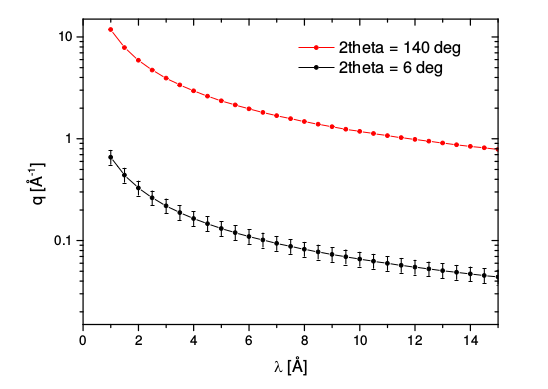
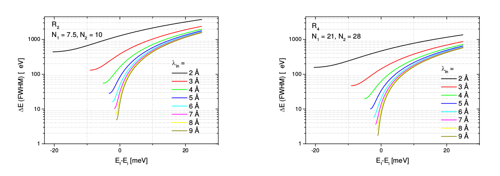
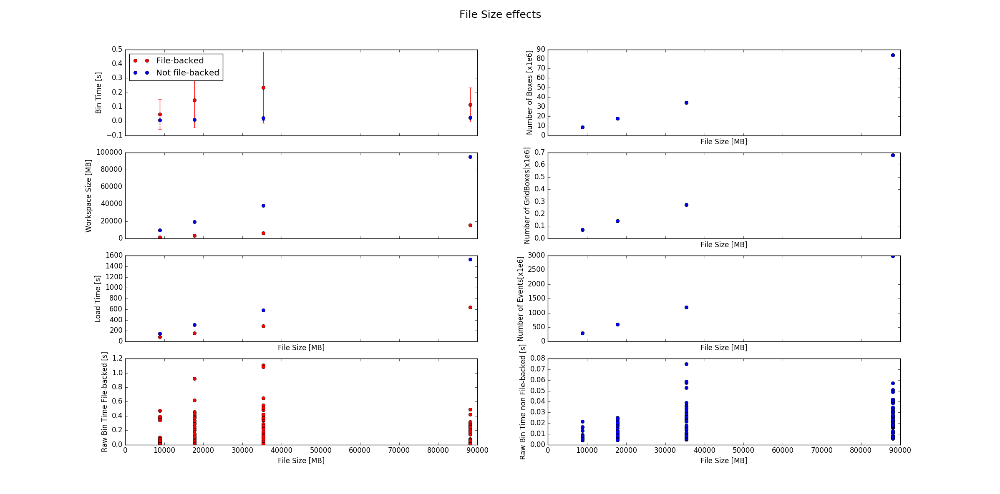
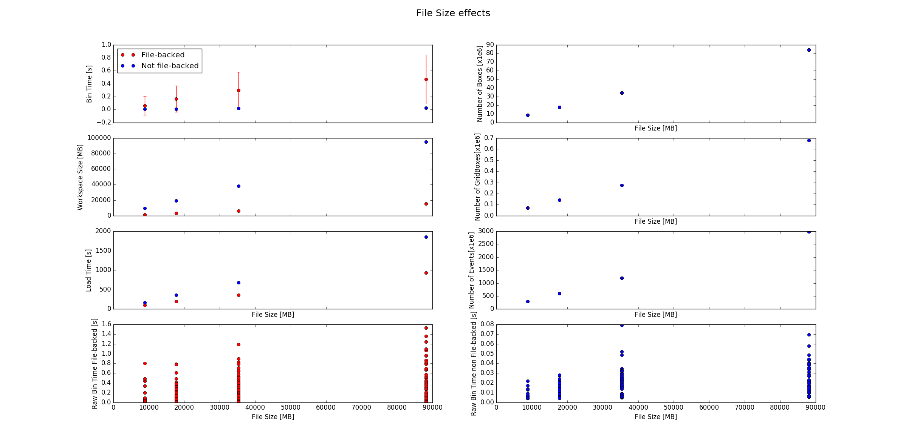
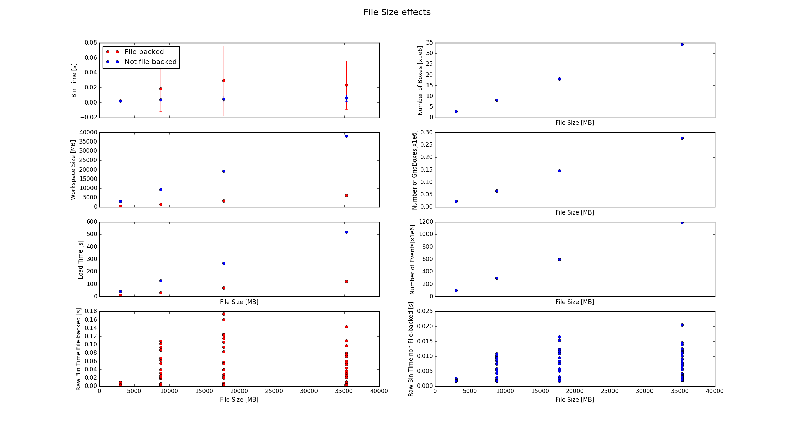
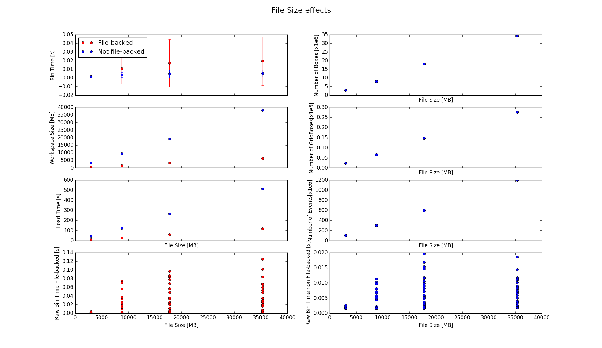

# Visualizations

### Currently

##### SliceViewer

The slice viewer can either hold an *MDEventWorkspace* or an *MDHistoWorkspace*.
The slice viewer is used by the instrument scientists to compare the
found and evaluated peaks against the data. This often requires some sort of
zoom into the data set, which requires a histogram-type slice of the data. This
slice is is generated from an *MDEventWorkspace*.

##### InstrumentView

This is only used by the instrument scientists at ISIS. It might be that they
could work solely using the *SliceViewer*. However, I have found that viewing
peaks, especially weak(ish) peaks in the *InstrumentView*  can provide
better results. The *InstrumentView* requires the original *MatrixWorkspace* since
it displays the data in detector space. The scientists edit the peaks that have
previously been found using one of the peak-finding algorithms, e.g. *FindPeaksMD*.

### Brainstorming: Solutions to make large data available in a viewer

1. Save the multi-dimensional data to disk and load as a file-backed workspace into
   a viewer. Experimented with `23GB` WISH data set. It took 16 minutes to generate
   and when loaded was only `450MB` in RAM. Operating the *SliceViewer* with dynamic
   rebinning worked well.
2. Save only the block structure to disk (provided we use the current
   *MDEventWorkspace* structure). The *MDEventWorkspace* will have a finer mesh
   in regions where instrument scientists want to zoom in.
3. Save the data in a very fine grained histogram-type workspace. The grain size
   would be determined by the amount of available resources to hold the
   histogram-type workspace and this could determine the binning. Then we need
   to teach *BinMD* to bin *MDHistoWorkspace* types. This approach is limited
   by the available system resources on the client machine. Especially for
   high-dimensional scenarios this might lead to an issue.
4. Hold the distributed multi-dimensional, event-type workspace
   (provided we have something like this) in memory and send a query for a slice.
   The slice is returned and we can plot it. This essentially would be a client
   server approach with a long-living session. This should produce slices
   in the low tens of megabyte range. However this is a blue sky solution.

#### Re Option 2
This will most likely lead to unsatisfactory results with the instrument scientists.

#### Re Option 3

For CSEPC we have a resolution of about 0.5% for both then energy and the
momentum transfer (see [here](../requirements_and_discussions/log.md)).
The minimum Q value according to `CSPEC_resubmission.pdf` is $0.06 \AA^{-1}$ and the
maximum Q value is around  $10 \AA^{-1}$. This, with a resolution of 0.5%,  means
we have a binning interval of  $0.06*0.005 \AA^{-1}=0.0003\AA^{-1}$. This would lead
to a number of about $3.7e13$ cells only for the momentum part. Hence this approach
is not really feasible.

In addition we need to consider the energy transfer, which is depicted below. From
this we take the range to be 40meV (is this valid?) and from `CSPEC_resubmission.pdf`
we take a smallest resolution of $8\mu eV$. This would lead to a grid of about
5000 cells, which is similar to [other energy estimations](../other/instruments_and_resolutions.md).

#### Re Option 4
From what Simon has said we need to be frugal with the compute resources and a
user who wants to visualize data cannot claim a substantial part of the cluster
for her visualization efforts for a long time (which would happen if we made the
cluster available in an interactive way.)

### Investigation of SliceViewer performance for large data sets

We want to investigate the scaling behaviour of the SliceViewer on a single
machine. We have used [this script](./file_backed_bin_md_evalution.py) and
variations thereof to perform the measurements.

##### Measurements on rotational disk machine (NoMachine)

We were able to produce large files (up to 90GB). The relevant curve in the
images below is in the left-hand top corner which shows the bin time vs. file size
for a bin slice of $0.1\\A^{-1}$ in the z direction. The binning parameters
were `-1.5,1.5,200` for both the x and y direction. We performed 50 bin operations
at varying locations.

Example runs are:

The two measurements show quite a different picture. While the first one
would suggest that the cost for binning does not increase the second one
does. However this increase is not very large and suggests that it should be
possible to allow binning for smaller (but realistic) window sizes. How this will
truly perform with 100 times more data is not quite predicatable based on these
measurements.

##### Measuremnt on SSD machine (Owen's machine)

The story is very similar on an SSD.

##### Measurement on rotational disk machine with varying thresholds (Anton's machine)

For smaller data sizes we get the following:

### MDVisualEvent

Since we want to visualize the data on a single machine we need to fight for
every byte of an event. A lot of the data which is stored in an *MDEvent* is
not required for the visualization. In principle only the position and the
signal value is of relevance. The following members could be removed:
* `float errorSquared` (4 bytes)
* `uint16_t runIndex`  (2 bytes)
* `int32_t detectorId` (4 bytes)

This would leave us with:
* `float signal` (4 bytes)
* `coord_t center[nd]` with `coord_t` mostly being `float` (nd * 4 bytes)

Stripping out these parts will save 10 bytes which is about $30-40\%$ for typical events, i.e. 3D and 4D.

### VisualBinMD

A manual test with the *SliceViewer* on the 90GB sample data set showed that the
bin operations can take a long time (seconds) when the region selected in the
*SliceViewer* is large, i.e. comparable with the actual workspace extents.
Similarly thick slices, on the order of the workspace extents, are typically slow too.
Typically the thickness is one percent of the extent or less. Similarly, rebinning
normally only matters when the user zooms into the data set. This means that we
could apply binning only once we have zoomed to a level where we expect to have
fewer than a certain number of events to fetch, at least in the dynamic rebin case.
If there are more events, we either:

1. show the structure as it is. This is the default in the *SliceViewer*. We would
   provide the user with information, explaining that rebinning will start when
   fewer than a (user-set?) number of events is being displayed.
2. provide "faux"-rebinning by using the boxes as event substitutes. However,
   this can create misleading representations of the distribution of events.
