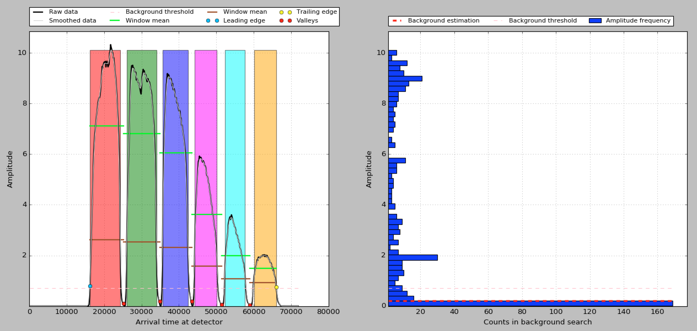
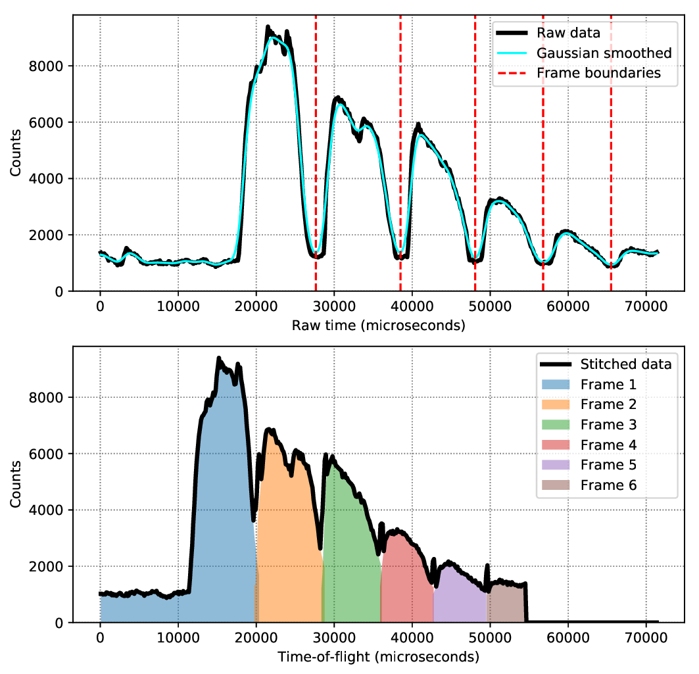
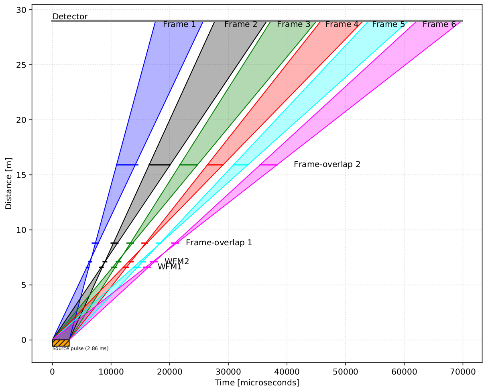

# Stitching wave-frame multiplication data at ESS

## 1. Introduction

There is currently two different methods that can be employed to perform what is commonly known as 'stitching' of neutron data that was recorded in wave-frame multiplication (WFM) mode at the ESS V20 test beamline.
This document describes in detail the two different methods, their advatanges and drawbacks, as well as listing links to where the software can be downloaded.

## 2. Method 1: Using peak-finding

### 2.1 Description of the frame-edge detection procedure

The procedure employed to find the WFM frames in the recorded data is the following.

1. The neutron counts from all pixels are histogrammed into a single spectrum, giving the characteristic bumped spectrum, shown as a black curve in Fig. 1 (left).
1. The spectrum is then smoothed using a [Gaussian filter](https://docs.scipy.org/doc/scipy/reference/generated/scipy.ndimage.gaussian_filter1d.html) using a standard deviation of 2 (grey curve).
1. The background estimation is carried out by histogramming the neutron counts in number-of-occurence bins, to find the most common count in the data. This will almost always be the background, which show a high occurence of very low counts, as can be seen in Fig. 1 (red dashed line in the right panel).
1. This raw background value is modified in a conservative way by adding to it 5% of the range between the raw background amplitude and the maximum amplitude in the data. This updated background value is represented by the pink dashed line in the right panel.
1. The leading (left) edge of the signal is then found by iterating through the spectrum, starting from the left hand side and finding the first data point that exceeds the updated background value. This edge is marked by a blue dot in the left panel. The same is repeated for the trailing edge (yellow dot), starting from the right hand side and iterating towards the left.
1. We then need to find 5 valleys (or inverted peaks) between these two edges. A [peak-finding](https://docs.scipy.org/doc/scipy/reference/generated/scipy.signal.find_peaks.html) algorithm from the Scipy library is called on the inverted data (to find the valleys). The `prominence` parameter is given a value of `0.05 * (signal_maximum - signal_minimum)`. The 5 valleys are marked with red dots in the left panel.
1. Once the 5 valleys, and hence the 6 frames, are found, we compute the mean amplitude inside each frame. These are represented by the green horizontal lines.
1. The inter-frame gaps are cut out by defining a frame edge as the first value, starting from the centre of a given valley, that exceeds 30% of the frame average (brown horizontal lines). The frame edges are found by starting from each of the five red dots and navigating through the spectrum towards first the left, to find the previous frame's upper bound, and then the right, to find the next frame's lower bound.
1. The leading (blue dot) and trailing (yellow dot) edges complete the set of frame boundaries.


**Figure 1:** Left: raw data from a diffraction experiment at V20, showing the 6 WFM frames in different colours, as well as various markers that illustrate the steps in the frame finding algorithm (see text). Right: Histogramming of counts in amplitude bins to detect the background as the most common count occurence.

**Links**

- The software that implements Method 1 can be found here: https://git.esss.dk/wedel/wfm_stitching.
- Contact: Neil Vaytet (ESS/DMSC), Owen Arnold (STFC, Tessella)

### 2.2 Applying the conversion to time-of-flight

Because WFM is essentially making 6 new pulses from a single long pulse, the position of the neutron source (or source chopper in the case of V20) is considered to be half-way between the two WFM choppers. In order to conserve the wavelength of the neutrons, the data needs to be converted  from 'Arrival time at detector' to real 'Time-of-flight'.

Each frame needs to be shifted by a different value, as described in [Woracek et al. (2016)](https://doi.org/10.1016/j.nima.2016.09.034). This article also outlines the method used to compute the different frame shifts, and this will thus not be repeated here. We simply list the numbers by which the frames were shifted:

| Frame number | 1 | 2 | 3 | 4 | 5 | 6 |
| --- | --- | --- | --- | --- | --- | --- |
| Tof shift [&mu;s] | -6630 | -9050 | -11303 | -13398 | -15344 | -17154 |

As explained in Woracek et al. (2016), the shifts for frames 2-6 are computed from the WFM chopper cut-out angles and rotation frequency, but depend on a initial frame shift for the first frame, which is free parameter. The value of the first frame shift (given in the table), was computed by fitting a Bragg edge to the WFM signal from an iron plate, using the same expenrimental set-up.

Figure 2 shows an example of neutron scattering data collected at V20 (Si sample), before (top) and after (bottom) stitching. Note that some artifacts (spikes) show up between some of the frames, due to signal overlap. However, these get corrected when the data is normalized by a monitor signal which shows identical artifacts.


**Figure 2:** Before (top panel) and after (bottom panel) the stitching procedure.

### 2.3 Short-comings of the peak-finding method

There are a number of short-comings of the peak finding method for finding the frame boundaries and applying the conversion to time-of-flight, which have led us to develop a second method, which is described in the next section.

#### 2.3.1 Peak-finding algorithms are unpredictable

Peak-finding algorithms are notoriously unstable, often requiring tuning to work on a case-by-case basis [Ref needed], which defies the point to trying to automate the task of finding frame edges. For instance, the values for the peak prominence and background estimation will almost certainly need to be adjusted if a large diffraction spike is present in the data.

#### 2.3.2 Peak-finding requires enough signal-to-noise

Enough signal-to-noise is required to be able to perform peak finding, meaning that it will most probably fail on noisy data. In addition, this implies that it is not possible to perform on-the-fly stitching on live data acquisition, as all the data needs to be collected before it can be stitched.

#### 2.3.3 Excessive grouping of detector pixels leads to blurring

The signal-to-noise requirement also poses another problem; the data for V20 were histogrammed into a single spectrum to obtain most optimal signal-to-noise, and this was a reasonable simplification of the data as the DENEX delay-line detector at V20 was a single square panel 30cm across. The small size and shape of the panel meant that the distance from the sample was similar for all detector pixels, and little blurring was observed in the single spectrum that grouped all the detector pixels.

However, this will not be true for all the instruments at ESS that are planning to make use of WFM. In some extreme cases, it might even be required to compute slightly different frame boundaries for each detector pixel.


## 3. Method 2: Using TOF diagrams in a post-processing step

The second method was developed as an attempt to solve the issues listed above. In principle, it is possible to predict the location of the frame boundaries analytically, using the information about the beamline. Indeed, using only the positions of the neutron source, the detector and the choppers, as well as the chopper rotation frequencies, we can construct a time-of-flight diagram for the instrument, as shown in Fig. 3 (see also [Strobl et al. 2013](https://www.sciencedirect.com/science/article/pii/S0168900212016142)). The time-of-flight diagram shows us the path taken by the slowest and fastest neutrons in the distance versus time space, effectively giving the boundaries of the frame at the position of the detector (28 m from the source).


**Figure 3:** Time-of-flight diagram for the V20 instrument in WFM mode.

Using this method has the following advantages:

1. No more peak-finding is required, which leads to more robust results.
1. Removing the need for peak-finding also removes the need for enough signal-to-noise before stitching can be performed. In principle, the TOF for each event could be individually corrected, as they come in, naturally enabling on-the-fly stitching of live data.
1. Analytical calculations of frame boundaries also make it possible to have a different correction for each individual pixel, thus maximizing the resolution of the instrument.

There are however some possible drawbacks to this method. Indeed, this solution assumes that everything is known about the instrument beamline's behaviour, and would probably not be very useful during an early operation phase such as hot commissioning. It can also be difficult to identify if something has gone wrong during the measurement, such as an out-of-phase chopper for instance, making the stitched data hard to interpret. We believe that this method could be used as a default, keeping Method 1 as a safety/sanity check, so that both methods would complement each other. It is also not entirely clear if neutron flight paths are trivial to calculate analytically for all instruments at ESS with WFM capabilities.

The software that implements Method 2 can be found [here](https://github.com/nvaytet/wfmess) (Note that there is currently no documentation on this project, as it is very much a work in progress). This is already an optimized version of the algorithm where the boundaries of the six frames are not searched for each event with
```Py
for e in raw_events:
    for n in len(frame_boundaries):
        if e >= frame_boundaries[n].lower and e < frame_boundaries[n].upper:
            e += frame_shifts[n]
            break
```
Instead, a large number (commonly of the order of 5000) of high-resolution equally spaced bins spanning the entire range of 'arrival time at detector' are created. Each one of these bins is given a TOF shift to be applied, depending on which frame number it corresponds to. Finally, the events can be efficiently processed with fast index finding:
```Py
# Set up the bins
Nbins = 5000
bins = np.linspace(tmin, tmax, Nbins + 1)
frame_number = np.zeros(Nbins, dtype=np.int32)
bin_width = bins[1] - bins[0]
for b in range(Nbins):
    x = bins[b] + 0.5 * bin_width
    for n in len(frame_boundaries):
        if x >= frame_boundaries[n].lower and x < frame_boundaries[n].upper:
            frame_number[b] = n
            break

# Perform correction to TOF
for e in raw_events:
    iframe = int((e - tmin) / bin_width)
    e += frame_shifts[frame_number[iframe]]
```
This assumes that the number of events to be processed is much higher than `Nbins`. This can provide 5x to 10x speedups for the conversion to TOF. Some questions remain as to whether such an optimization is applicable to the case where different corrections are applied to different detector pixels if a very large number of pixels is present, as having 5000 different bins for 1M pixels does not fit in memory for common computers.

**Links**

- The software is available at: https://github.com/nvaytet/wfmess
- Contact: Neil Vaytet (ESS/DMSC)

## 4. In-reduction stitching vs post-processing stitching

The early versions of the stitching procedure (including Method 1) depended on the Mantid software to perform the stitching, and consisted of several function calls that had to be made in a reduction workflow in order to stitch the data before further manipulation/reduction could be carried out. This was reported to be very time-consuming by several users, as they had to re-run a potentially lengthy stitching step, which was always performing the same calculations.

In principle, stitching is only required to be run once, as very little tweaking of the stitching parameters should be necessary. In addition, some users were carrying out a study that was comparing WFM and single-pulse data using the same sample set-up, and were having to maintain two different (but very similar) reduction scripts, depending on whether they were reducing WFM or single-pulse data.

We thus propose that WFM stitching could be implemented as a post-processing step in the data acquisition. The raw data could be read in, stitched using the parameters from the beamline (the Nexus geometry is contained inside the data file), and a new post-processed file would then be written (and added to SciCat) to disk. All the parameters that were used for the stitching would be included in the file metadata. This would effectively alleviate all the issues listed above.

The users would still have access to the raw un-stitched data, so that they are able to perform the stitching themselves, if they suspect something went wrong during that phase. But for 99% of cases, assuming auto-reduction is operating to satisfaction at an ESS facilty in full production mode, automatic post-processed stitching should work nicely.

Going one step further, one could even imagine including the event-by-event stitching (although it makes less sense to call it 'stitching' here, 'conversion to time-of-flight' may be more appropriate) as part of the filewriter. It should be possible to write the raw and stitched data files simultaneously, thus cutting out the time needed to re-read the raw data to perform the conversion.

## 5. Conclusion and distribution

We conclude that both peak-finding and analytical predictions for WFM frame boundary determination should be complementary. While Method 1 presents several major drawbacks that make it unfit to a production set-up, it should prove extremely useful as a diagnostic or verification tool during the hot commissioning phase.

The programs to perform the WFM stitching should be distributed as follows:

1. A separate package containing the frame boundary determination, which would be distributed on `pip` and `conda`. This should aim to remain Python-only, with no large dependencies such as Mantid. This package would allow a user to decide which method they want to use to obtain the frame boundaries: either using the peaking finding, or the TOF diagram, or just a manual input. This package would also provide a basic (non-optimized) method to perform the TOF conversion, that could be used by e.g. Mantid users who do not wish to use the Scipp package.
1. A highly-optimized C++ algorithm to perform the conversion to TOF will be included as part of the [Scipp-neutron](https://scipp.github.io/scipp-neutron/overview.html) module. This would be used in the auto-reduction post-processing step. I will first import the aforementioned Python package to get the frame boundaries, and then perform the conversion.
